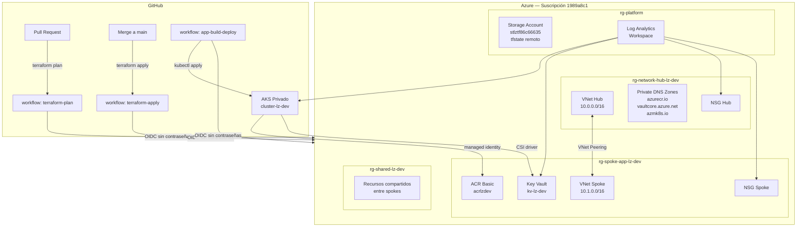

# Landing Zone — Mini Plataforma en Azure con CI/CD y GitHub Copilot

> Evaluación final del path de capacitación · Modalidad individual · 16 h
> Autor: Alejandro Arelis · [@alejandromobiik](https://github.com/alejandromobiik)

---

## ¿Qué es este proyecto?

Este repositorio construye una **landing zone** (zona de aterrizaje) en Azure.
Una landing zone es la infraestructura base que una empresa monta *antes* de desplegar sus aplicaciones: redes, seguridad, registros, permisos y automatización listos para usar.

En lugar de hacer clic en el portal de Azure, todo se escribe como código. Eso significa que:
- Cualquier cambio queda registrado en Git (historial completo).
- Un robot (pipeline de GitHub Actions) valida y despliega los cambios automáticamente.
- Si algo se rompe, se puede volver atrás con un solo comando.

El código se escribe con la asistencia de **GitHub Copilot**, documentando cómo se usó el asistente en cada pieza.

---

## Arquitectura



---

## Cómo sustituimos lo que normalmente vive en el tenant

La evaluación exige trabajar **solo con permisos de suscripción** (sin management groups corporativos). Esta tabla explica cómo se resuelve cada limitación:

| Lo que normalmente está en el tenant | Cómo lo sustituimos aquí |
|--------------------------------------|--------------------------|
| Management Groups y jerarquía corporativa | 4 Resource Groups por tier (`rg-platform`, `rg-network-hub`, `rg-spoke-app`, `rg-shared`) con la jerarquía documentada |
| Azure Policy a nivel tenant/MG | 3 policies builtin a nivel de suscripción y RG: tags obligatorios, ubicaciones permitidas, deny de acceso público en Storage |
| Hub central compartido con ExpressRoute | Hub-spoke dentro de la suscripción con VNet Peering local, NSGs y Private Endpoints |
| Administración de Entra ID | Managed Identities (system y user-assigned) + RBAC sobre recursos concretos |
| Defender for Cloud corporativo | Planes de Defender habilitados a nivel de suscripción (Servers, Containers, Key Vault) |
| Log Analytics workspace central del tenant | Workspace propio en `rg-platform` con diagnostic settings desde cada recurso |

---

## Estructura del repositorio

```
landing-zone/
├── .github/
│   └── workflows/
│       ├── terraform-plan.yml      # Se ejecuta en cada Pull Request
│       ├── terraform-apply.yml     # Se ejecuta al hacer merge a main
│       └── app-build-deploy.yml    # Build de imagen Docker → push ACR → deploy AKS
├── app/
│   ├── app.py                      # Aplicación Flask mínima
│   ├── requirements.txt
│   └── Dockerfile                  # Multi-stage: build + imagen final ligera
├── infra/
│   └── terraform/
│       ├── modules/
│       │   ├── network/            # VNets, subnets, NSGs, peering, DNS privado
│       │   ├── aks/                # Clúster Kubernetes privado
│       │   ├── acr/                # Azure Container Registry
│       │   ├── keyvault/           # Key Vault con Private Endpoint
│       │   ├── monitoring/         # Log Analytics, alertas, KQL
│       │   └── policy/             # Azure Policies (tags, ubicaciones, storage)
│       ├── main.tf                 # Orquestador: llama a todos los módulos
│       ├── variables.tf            # Variables de entrada (location, environment…)
│       ├── outputs.tf              # Valores que expone el módulo raíz
│       ├── providers.tf            # Versiones de Terraform y proveedores Az
│       ├── backend.tf              # Dónde se guarda el estado (Azure Storage)
│       └── .terraform.lock.hcl    # Lock de versiones exactas de providers
├── docs/
│   ├── commands-log.txt            # Registro cronológico de todos los comandos
│   ├── copilot-log.md              # Bitácora de uso de GitHub Copilot
│   ├── architecture.md             # Diagrama detallado y decisiones de diseño
│   └── practicas-y-reglas.md      # Reglas y lecciones aprendidas del proyecto
├── scripts/
│   └── bootstrap.ps1              # Script de preparación de Azure (idempotente)
└── README.md                       # Este archivo
```

---

## Estado actual del proyecto

### ✅ Completado

| Fase | Descripción | Recursos en Azure |
|------|-------------|-------------------|
| **Fase 0** | Herramientas instaladas (VS Code, Git, Azure CLI, Terraform, pwsh, kubectl, Docker) | — |
| **Fase 1** | Repositorio GitHub con branch protection en `main` (PR obligatorio + 1 approval) | — |
| **Fase 2** | Script `bootstrap.ps1` idempotente con `-WhatIf`, Federation Credentials OIDC, RBAC | `rg-platform`, Storage Account `stlztf86c66635`, contenedor `tfstate` |
| **Fase 3** | Backend remoto, providers, variables, outputs, `main.tf` con 4 Resource Groups | `rg-network-hub-lz-dev`, `rg-spoke-app-lz-dev`, `rg-shared-lz-dev` |

### ⏳ Pendiente

| Fase | Descripción |
|------|-------------|
| **Fase 4** | Red hub-spoke: VNets, NSGs, peering, Private DNS Zones |
| **Fase 5** | Seguridad: Key Vault, Managed Identities, Azure Policies, Defender |
| **Fase 6** | Observabilidad: Log Analytics, alertas de CPU, consultas KQL |
| **Fase 7** | AKS privado + ACR Basic |
| **Fase 8** | Aplicación Flask contenerizada desplegada en AKS |
| **Fase 9** | Pipelines GitHub Actions con OIDC (plan en PR, apply en merge, build+deploy) |
| **Fase 10** | Documentación final, bitácora de Copilot, diagrama de arquitectura |

---

## Cómo reproducir este proyecto desde cero

### Prerequisitos

- Cuenta de Azure con suscripción activa
- [Visual Studio Code](https://code.visualstudio.com) con extensiones: GitHub Copilot, Terraform, Azure Tools, YAML
- [Git](https://git-scm.com)
- [Azure CLI](https://docs.microsoft.com/cli/azure/install-azure-cli) — verifica con `az --version`
- [Terraform >= 1.7](https://developer.hashicorp.com/terraform/downloads)
- [PowerShell 7](https://github.com/PowerShell/PowerShell/releases) (`pwsh`) con módulo Az instalado
- [kubectl](https://kubernetes.io/docs/tasks/tools/) y [Docker Desktop](https://www.docker.com/products/docker-desktop/)

### Paso 1 — Clonar el repositorio

```bash
git clone https://github.com/alejandromobiik/landing-zone.git
cd landing-zone
```

### Paso 2 — Ejecutar el bootstrap de Azure

El script crea el Resource Group y Storage Account donde Terraform guarda su estado, las credenciales OIDC del Service Principal y el RBAC necesario.

```powershell
# Primero simula qué haría (sin crear nada)
pwsh -File scripts\bootstrap.ps1 -WhatIf

# Luego ejecuta de verdad
pwsh -File scripts\bootstrap.ps1
```

> El script es **idempotente**: puedes ejecutarlo varias veces sin error. Si un recurso ya existe, lo detecta y continúa.

### Paso 3 — Inicializar Terraform

```bash
cd infra/terraform
terraform init      # descarga los providers y conecta con el backend de Azure
terraform validate  # verifica la sintaxis
terraform plan -out=tfplan  # calcula los cambios (sin aplicarlos)
terraform apply "tfplan"    # crea/modifica los recursos
```

### Paso 4 — Flujo de cambios (después de la configuración inicial)

Cualquier cambio al código de infraestructura sigue este flujo:

```
1. Crea una rama: git checkout -b feat/mi-cambio
2. Edita los archivos .tf
3. Verifica: terraform fmt -recursive && terraform validate
4. Commit y push: git add . && git commit -m "descripción" && git push origin feat/mi-cambio
5. Abre un Pull Request en GitHub
   → El pipeline terraform-plan.yml se ejecuta automáticamente
   → El resultado del plan aparece como comentario en el PR
6. Aprueba el PR y haz merge a main
   → El pipeline terraform-apply.yml se ejecuta y aplica los cambios
```

---

## Decisiones de diseño importantes

### ¿Por qué Terraform y no Bicep?
Terraform es agnóstico de proveedor (funciona con Azure, AWS, GCP), tiene un ecosistema de módulos muy maduro y es la herramienta más demandada en el mercado para IaC multi-cloud.

### ¿Por qué estado remoto en Azure Storage?
El estado local (en tu máquina) hace imposible que los pipelines de CI/CD funcionen. Azure Storage habilita automáticamente el "state locking": si dos pipelines intentan aplicar cambios al mismo tiempo, el segundo espera — evitando corrupción del estado.

### ¿Por qué OIDC en lugar de Client Secret?
Un Client Secret es una contraseña que puede filtrarse si alguien accede al repositorio. OIDC genera un token temporal que Azure verifica directamente con GitHub — sin contraseñas almacenadas, sin riesgo de filtración.

### ¿Por qué ACR Basic en lugar de Premium?
El proyecto usa una suscripción de Free Trial con presupuesto limitado. ACR Basic cuesta ~$0.17/día vs ~$1.67/día de Premium. Los Private Endpoints de ACR (que requieren Premium) se implementan a nivel de NSG en su lugar.

### ¿Por qué AKS con `Standard_B2s`?
Es el nodo más pequeño compatible con AKS en producción. Para reducir costos, el clúster debe detenerse cuando no se trabaja:
```bash
az aks stop --name aks-lz-dev --resource-group rg-spoke-app-lz-dev
az aks start --name aks-lz-dev --resource-group rg-spoke-app-lz-dev
```

---

## Seguridad

- **Cero secretos en el repositorio**: los valores sensibles se marcan como `sensitive = true` en Terraform y se consumen desde Key Vault en runtime.
- **OIDC para CI/CD**: los pipelines se autentican mediante Workload Identity Federation, sin credenciales de larga duración.
- **Mínimo privilegio**: el Service Principal solo tiene `Contributor` en la suscripción y `Storage Blob Data Contributor` en el Storage Account del tfstate.
- **Network isolation**: AKS y Key Vault son privados — no exponen endpoints públicos.

---

## Uso de GitHub Copilot

Todo el código de este proyecto fue escrito con asistencia de GitHub Copilot. La bitácora completa de prompts, sugerencias aceptadas/rechazadas y casos donde Copilot se equivocó está en [docs/copilot-log.md](docs/copilot-log.md).

---

## Licencia

Proyecto de evaluación educativa · Sin licencia de producción.
